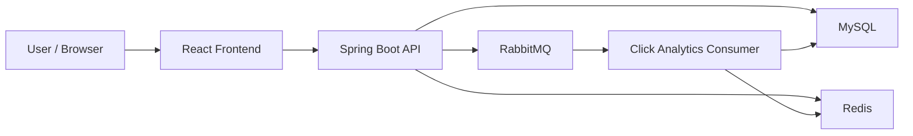

# SnapURL Architecture Notes

This document is meant as a personal interview reference for understanding what SnapURL does internally, why certain technologies were used, and how the important flows work.

## 1. Project Goal

SnapURL is a URL shortening platform with:

- user authentication
- short link creation and deletion
- custom aliases
- analytics tracking
- dashboard search/filter/sort/pagination
- backend performance and security features

The project is not just about generating a short URL. The more important goal is to show how a backend system can evolve into a more production-minded design.

## 2. High-Level Architecture

## 3. Why These Technologies Were Used

### Spring Boot

Spring Boot is the main backend framework. It handles:

- REST APIs
- authentication and authorization
- JPA persistence
- transactions
- background processing integration

It gives structure to the backend and makes it easier to separate controllers, services, repositories, and security logic.

### MySQL

MySQL is the system of record. It stores:

- users
- shortened URLs
- click events
- refresh tokens
- password reset codes

MySQL is the durable source of truth. Even when Redis is used, MySQL remains the final trusted storage layer.

### Redis

Redis is used for speed and control, not as primary storage. It is used for:

- redirect caching
- analytics caching
- rate limiting

This improves performance and reduces repeated database work.

### RabbitMQ

RabbitMQ is used to move analytics writes off the redirect request path. This means:

- redirects stay faster
- click tracking is asynchronous
- analytics work is decoupled from user-facing latency

### React Frontend

The frontend is the dashboard and public UI. It handles:

- login / register / forgot-password screens
- link creation
- dashboard analytics and filtering
- token-aware API requests

## 4. Main Backend Modules

### Controllers

Controllers expose HTTP endpoints.

Important controllers include:

- `AuthController`
- `UrlMappingController`
- `RedirectController`

They are responsible for:

- receiving requests
- validating request shape at the API boundary
- delegating business logic to services
- returning responses

### Services

Services contain most of the business logic.

Important service classes include:

- `UserService`
- `UrlMappingService`
- `ClickAnalyticsProcessor`
- `RedisRateLimitService`
- `RedisShortUrlCacheService`
- `RedisAnalyticsCacheService`

This layer is where most of the interesting backend behavior lives.

### Repositories

Repositories handle persistence.

Important repository types:

- user repository
- URL mapping repository
- click event repository
- refresh token repository
- password reset code repository

Repositories are used for both standard JPA operations and targeted custom queries.

## 5. Important Data Models

### Users

The `Users` table stores:

- email
- username
- password hash
- role
- failed login attempts
- temporary account lock time

This supports both authentication and brute-force protection.

### UrlMapping

This is the core short-link entity. It stores:

- original URL
- short code
- click count
- created time
- last accessed time
- expiration time
- owning user

This is the central entity used in the dashboard and redirect flow.

### ClickEvent

Each click is stored as an event. This allows:

- daily analytics
- chart generation
- per-link click history

This is more useful than storing only a total counter because event history can be aggregated in different ways.

### RefreshToken

Refresh tokens are stored in the database so that:

- refresh tokens can be rotated
- tokens can be revoked
- password reset can invalidate existing sessions

### PasswordResetToken

This entity now acts as a one-time reset code store. It contains:

- the code
- expiry time
- used flag
- owning user

Even though the class name still says `PasswordResetToken`, functionally it stores a one-time reset code.

## 6. Core Flows

## 6.1 Registration Flow

1. User submits username, email, and password
2. Backend validates:
   - supported email provider
   - username length
   - password length
   - duplicate username/email
3. Password is hashed
4. User record is saved in MySQL

Important design points:

- email is normalized to lowercase
- password is never stored raw
- duplicates are blocked before save and also protected by DB constraints

## 6.2 Login Flow

1. User submits email and password
2. Redis-backed rate limiter checks whether too many attempts are being made from the same IP/email combination
3. Backend checks whether the account is temporarily locked
4. Spring Security authenticates credentials
5. On success:
   - failed attempt count resets
   - lock state clears
   - access token is issued
   - refresh token is created and stored
6. On failure:
   - failed attempts increase
   - after threshold is reached, account is locked for a time window

This gives two layers of protection:

- request-level login throttling via Redis
- account-level lockout via database state

## 6.3 Refresh Token Flow

1. Frontend sends refresh token to backend
2. Backend checks:
   - token exists
   - token is not revoked
   - token is not expired
3. Old refresh token is revoked
4. New access token is created
5. New refresh token is generated and saved

This is refresh token rotation.

Why it matters:

- stolen refresh tokens become less useful
- sessions are easier to control
- stronger than keeping one long-lived JWT only

## 6.4 Forgot Password Flow

1. User enters email
2. Backend validates provider and normalizes email
3. Existing active reset codes for that user are invalidated
4. Backend generates a unique 6-digit reset code
5. Code is stored with expiry
6. If SMTP is enabled, code is sent by email
7. User submits code + new password
8. Backend verifies code, expiry, and unused state
9. Password is updated
10. Existing refresh tokens are revoked

Why revoke refresh tokens here:

- if someone resets the password, old sessions should not remain active

## 6.5 Short URL Creation Flow

1. User submits original URL
2. Optional custom alias may also be submitted
3. Backend validates URL
4. If custom alias exists:
   - validate alias pattern
   - reject reserved aliases
   - reject duplicates
5. If no alias is given:
   - check whether the same authenticated user already shortened the same original URL
   - if yes, reuse that link
   - otherwise generate a new code
6. Save the URL mapping
7. Cache the redirect mapping in Redis

This gives:

- safe alias support
- duplicate reduction for same-user same-URL cases
- immediate cache warmup for redirect lookups

## 6.6 Redirect Flow

This is the most performance-sensitive flow in the system.

1. User opens a short URL
2. Backend checks Redis first for the short code
3. If found, return the original URL quickly
4. If not found:
   - query MySQL
   - update Redis cache
5. Redirect response is sent
6. Analytics tracking is dispatched asynchronously

Why this matters:

- Redis reduces repeated database reads
- redirect latency stays lower
- analytics work is separated from the response path

## 6.7 Analytics Flow

1. Redirect creates a click event message
2. Message is published through RabbitMQ when async mode is enabled
3. Consumer processes the message
4. Consumer:
   - increments click count
   - updates last accessed timestamp
   - inserts click event row
   - evicts analytics cache

Originally, click processing updated the whole `UrlMapping` entity. That could cause deadlocks when many clicks hit the same link concurrently.

The fix was:

- replace full entity save with a targeted update query for:
  - `clickCount = clickCount + 1`
  - `lastAccessed = clickedAt`

This reduces row contention and makes concurrent click handling safer.

## 7. Redis Usage in Detail

Redis is used in three important ways.

### 7.1 Redirect Cache

Purpose:

- avoid hitting MySQL for repeated short-link lookups

Flow:

- key: short URL
- value: original URL and related redirect data
- populated on create and cache miss
- evicted on delete

### 7.2 Analytics Cache

Purpose:

- speed up dashboard analytics reads

Used for:

- per-link analytics
- total click summaries

Eviction:

- when new click events are processed
- when links are deleted

### 7.3 Rate Limiting

Purpose:

- protect public endpoints from abuse
- slow brute-force login attempts

Used for:

- public shorten API
- authenticated shorten API
- login attempts

The Redis implementation uses atomic counter logic so limits are reliable across requests.

## 8. RabbitMQ Usage in Detail

RabbitMQ is used for click analytics only.

### Why it was added

If analytics were written synchronously in the redirect request:

- redirect responses would be slower
- database writes would be on the critical path
- traffic spikes would affect user-facing latency more directly

### What RabbitMQ changes

- redirect returns earlier
- analytics are processed in the background
- consumer can handle click persistence separately

This makes the architecture more realistic for a backend-focused project.

## 9. Search, Filtering, Sorting, Pagination

The dashboard uses server-side querying instead of doing everything in the browser.

Supported capabilities:

- search by short code and original URL
- filter by date range
- filter by min/max click count
- filter by active/expired status
- sort by latest, clicks, and last accessed
- paginated results

Why this matters:

- scalable data access
- smaller payloads
- more realistic SaaS dashboard behavior

## 10. Security Decisions

### Auth

- JWT access tokens
- refresh token rotation
- refresh token revocation on password reset

### Login Protection

- Redis-backed login rate limiting
- temporary account lockout after repeated failed logins

### URL and Alias Validation

- custom alias validation
- reserved words blocked
- duplicate alias prevention
- stricter URL validation than simple regex-only checks

### Secret Management

Secrets were moved out of tracked configuration and into `.env` based values so the repo is safer to push.

## 11. Tradeoffs and Honest Limitations

This project is much stronger than a basic CRUD app, but it is still application-level architecture, not a full production platform.

Examples:

- reset codes are stored directly, not hashed
- mail delivery exists, but no email template engine is used
- no audit log system yet
- no metrics/observability layer yet
- no multi-region or horizontally distributed deployment story yet

These are good talking points in interviews because they show you understand what is done and what is still missing.

## 12. Best Interview Summary

If you want a clean way to explain the project:

> SnapURL is a full-stack URL shortening platform with a Spring Boot backend and React frontend. The backend supports JWT auth with refresh tokens, password reset via one-time codes, Redis caching, Redis-based rate limiting, temporary account lockout, RabbitMQ-based asynchronous click analytics, and server-side dashboard querying with filtering, sorting, and pagination. Redis is used for hot redirect lookups and analytics caching, while RabbitMQ decouples click tracking from redirect latency.

## 13. What to Remember Before an Interview

Focus on these points:

- why Redis was added
- why RabbitMQ was added
- why refresh tokens are better than one long-lived JWT
- why login rate limiting and account lockout are separate protections
- why analytics are event-driven
- why redirect performance is sensitive
- how deadlock risk was reduced in click processing
- how server-side filtering/pagination is better than client-side dashboard filtering

If you can explain those clearly, you will sound like someone who understands backend design choices rather than someone who only followed tutorials.
